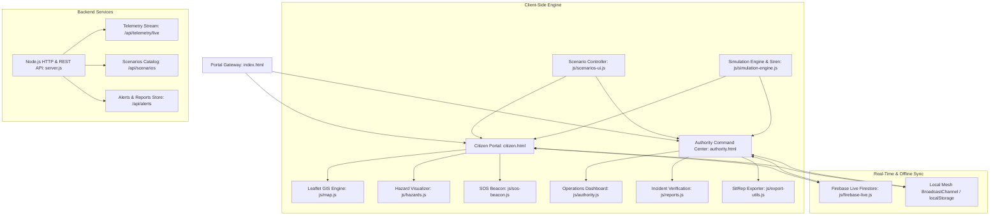

# 🔴 Risk2Rescue — Disaster Management & Hazard Intelligence Platform

> **AI-Powered Multi-Hazard Intelligence, Early Warning GIS Platform, and Authority Incident Command System**  
> *Powered by Risk2Rescue*

---

## 🌟 Overview

**Risk2Rescue** is an operational disaster management and predictive GIS intelligence platform designed for both citizens and disaster response authorities (NDRF, SDMA, IMD, CWC, GSI, INCOIS). 

It bridges the gap between complex multi-sensor telemetry and life-saving decision-making, offering intuitive GIS evacuation intelligence for citizens alongside an operational command suite for disaster officers.

---

## 🚀 Key Features

### 🧑‍💼 Citizen & Community Portal (`/citizen`)
- **Realistic GeoJSON Hazard Polygon Overlays**:
  - Replaced circular bubble markers with organic, shape-based polygon overlays that naturally follow coastal contours, river floodplains, and terrain ridges.
  - Semi-transparent color fills with soft glowing drop-shadow edges (`Red`, `Orange`, `Yellow`, `Green`).
  - Centroid-pinned floating glassmorphic labels (e.g., `🔴 Kakinada Landfall Corridor`) replacing raw numeric badges.
  - Clean SVG POI markers for safe evacuation shelters (shield), habitations (house), emergency hospitals ('H'), and historical disasters.
- **Windy.com Multi-Layer Weather & Hazard Radar Integration**:
  - **Dual-Engine Map Switcher**: Toggle seamlessly between `[ 🗺️ GIS Risk Map ]` and `[ 🛰️ Windy Radar ]`.
  - **18+ Official Weather & Hazard Overlays**: Wind streams, Wind Gusts, Thunderstorms/CAPE, Pressure, Rain & Thunder, Rain Accumulation, Precipitation Type, Temperature, Clouds, Humidity, Waves, Ocean Swell, Currents, PM2.5 AQI, NO2, Aerosol AOD, Fire Danger (FWI), and Live Composite Radar.
  - Floating categorized Weather Layers panel matching Windy's official app interface.
- **Automated GPS Geolocation & Location Resolver (`js/location-service.js`)**:
  - Automatically captures citizen coordinates on entry via the Geolocation API.
  - Reverse-geocodes coordinates and executes backend point-in-polygon checks (`/api/risk-zone`).
  - Fallback dropdown selection for Andhra Pradesh districts.
- **Multi-Hazard GIS Map**: Interactive Leaflet-powered GIS interface with color-coded risk zones, safe areas, evacuation corridors, and shelter points.
- **7 Hazard Profiles**: Real-time switching between *Cyclone*, *Flood*, *Landslide*, *Earthquake*, *Tsunami*, *Cloudburst*, and *Coastal Erosion*.
- **Evacuation Intelligence ("Show me the way out")**: Computes closest designated relief shelters and route corridors.
- **Dynamic Timeline Simulator**: Step through 48-hour forward forecasts (`Now`, `+3h`, `+6h`, `+12h`, `+24h`, `+48h`).
- **Emergency SOS Distress Beacon (`js/sos-beacon.js`)**:
  - One-touch emergency SOS trigger.
  - Automatically captures GPS coordinates and transmits an urgent rescue dispatch card to the Command Center queue.
  - Displays instant emergency hotline shortcuts (NDRF 1078, Police 112, Ambulance 108).
- **Incident Reporting**: Allows citizens to submit geotagged crowd reports (flood water height, stranded persons, blocked routes).

---

### 🏛️ Authority Command Center (`/authority`)
- **Operational Situational Picture**:
  - Live GIS Risk Map with tactical multi-threat overlays.
  - Monitored hazard metrics (wind gusts, storm surges, river gauge flood marks).
- **Zoning & Habitations**: Population-at-risk analytics across 24 critical red zones.
- **Safe Sites & Shelters**: Real-time capacity saturation tracking and logistics.
- **Citizen Report Queue**: Incident triage and verification workflow for emergency responders.
- **Sensor Fusion Feeds**: Doppler Radar (IMD), Satellite Thermal Scans (ISRO Bhuvan), River Gauges (CWC), and Slope Inclinometers (GSI).
- **Situation Report (SitRep) Exporter (`js/export-utils.js`)**:
  - Auto-compiles an executive operational SitRep.
  - One-click print-to-PDF or export to structured JSON.

---

### 🎮 Live Disaster Drill Simulation Engine (`js/simulation-engine.js`)
- **Interactive Drill Controller**:
  - 5-Phase Drill: Advisory -> Evacuation Order -> Peak Impact -> Rescue Containment -> Recovery.
  - Live casualty mitigation ticker and simulated clock.
- **Web Audio Synthesized Warning Siren**:
  - Built using the native HTML5 **Web Audio API** (no external audio files required!).
  - Generates realistic two-tone undulating emergency sirens and melodic broadcast warning chimes.

---

### 🌍 Multi-Hazard Scenarios (`data/scenarios.json` & `js/scenarios-ui.js`)
Switch between 5 pre-configured national disaster scenarios with one click:
1. **Super Cyclone Landfall (Cat 4 Impact)** — *Kakinada & Godavari Delta, Andhra Pradesh*
2. **Brahmaputra Major Basin Inundation** — *Guwahati & Kamrup Valley, Assam*
3. **Chamoli Glacial Debris Flow & Landslide** — *Garhwal Himalayas, Uttarakhand*
4. **Kachchh Major Fault Rupture (M7.1)** — *Bhuj Fault Line, Gujarat*
5. **Wayanad Cloudburst & Flash Mudflow** — *Western Ghats, Kerala*

---

## 🏗️ Architecture



---

## 📁 Project Directory Structure

```text
Teja/
├── index.html                  # Portal Gateway & Persona Selection
├── citizen.html                # Citizen GIS Map & Evacuation Portal
├── authority.html              # Authority Incident Command Center
├── server.js                   # Zero-dependency Node.js HTTP & REST server
├── package.json                # Project manifest & run scripts
├── README.md                   # Comprehensive project documentation
├── css/
│   ├── base.css                # Global design system & tokens
│   ├── login.css               # Portal gateway styling
│   ├── citizen.css             # Citizen Leaflet GIS UI styles
│   ├── authority.css           # Command Center operational styles
│   └── simulation.css          # Drill HUD, Siren badge, SOS modal, SitRep styles
├── js/
│   ├── data.js                 # Base geospatial and telemetry data
│   ├── map.js                  # Leaflet map core configuration
│   ├── hazards.js              # Multi-hazard layers & zone polygons
│   ├── citizen.js              # Citizen portal interactivity
│   ├── authority.js            # Authority operations & Chart.js logic
│   ├── alerts.js               # Emergency alerts management
│   ├── reports.js              # Citizen report handling & queue
│   ├── firebase-config.js      # Firebase configuration & runtime keys
│   ├── firebase-live.js        # Real-time Firestore & BroadcastChannel sync
│   ├── firebase-modal.js       # Live Firebase connection settings UI
│   ├── simulation-engine.js    # Multi-phase drill engine & Web Audio siren
│   ├── sos-beacon.js           # Emergency SOS distress beacon dispatcher
│   ├── export-utils.js         # Incident Commander SitRep generator & exporter
│   └── scenarios-ui.js         # Scenario picker and map flyTo synchronizer
└── data/
    └── scenarios.json          # 5 Realistic disaster simulation scenario profiles
```

---

## ⚡ Quick Start Guide

### Option 1: Using the Node.js Development Server (Recommended)
You have Node.js installed. Simply run:

```bash
# Start the local server
node server.js

# Or using npm
npm start
```

Open your browser and navigate to:
- **Gateway**: [http://localhost:3000](http://localhost:3000)
- **Citizen Portal**: [http://localhost:3000/citizen](http://localhost:3000/citizen)
- **Authority Command Center**: [http://localhost:3000/authority](http://localhost:3000/authority)

### Option 2: Direct Browser Launch (Static Mode)
Double-click `index.html`, `citizen.html`, or `authority.html` directly in your file manager. The entire frontend works with zero server requirements.

---

## 📡 REST API Reference

The built-in `server.js` provides useful mock telemetry and data endpoints:

| Endpoint | Method | Description |
| :--- | :---: | :--- |
| `/api/health` | `GET` | Health check, uptime, active threats count, and version |
| `/api/scenarios` | `GET` | Returns catalog of 5 disaster simulation scenarios |
| `/api/telemetry/live` | `GET` | Real-time Doppler radar gusts, river gauge levels, and shelter stats |
| `/api/risk-zone` | `POST` | Point-in-polygon risk assessment and nearest shelter routing |
| `/api/windy/point-forecast` | `POST` | Windy Point Forecast proxy with 20-min cache and hazard trigger logic |
| `/api/alerts` | `GET / POST` | Retrieve or dispatch emergency broadcast alerts |
| `/api/reports` | `GET / POST` | Retrieve or submit citizen incident reports |
| `/api/export-sitrep` | `GET` | Generates a structured Incident Commander SitRep JSON |

---

## 🛡️ Credits & License
- **Author**: Teja
- **License**: MIT
- **Data Standards Grounding**: Fused with concepts from NDRF, IMD, CWC, GSI, and INCOIS.
